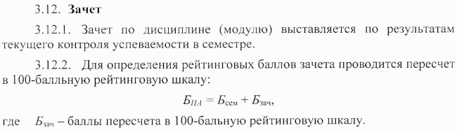
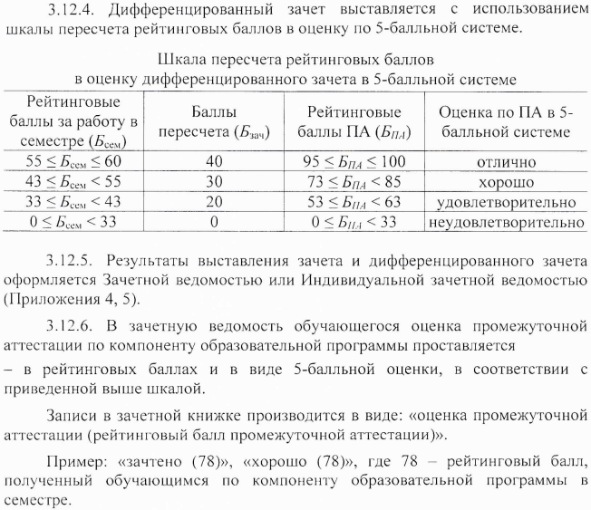

# Алгоритмизация и программирование

- Год поступления студентов: 2021;
- Всего: X часов;
- Аудиторная работа: X часов;
- Самостоятельная работа: X часов;
- Основной язык: С++;
- Аттестация: диф. зачёт;

*\* Академический час - 45 минут, т.е. пол пары.*

 

## Ссылки на материалы курса

- Курс на мудле: [https://moodle.cfuv.ru/course/view.php?id=22885](https://moodle.cfuv.ru/course/view.php?id=22885);
- Материалы на GitHub: [https://github.com/VladimirChabanov/alg_and_prog_03.03.03](https://github.com/VladimirChabanov/alg_and_prog_03.03.03);
- Доступ к практическим заданиям: [заполните форму](https://docs.google.com/forms/d/e/1FAIpQLSdGawEno5apuJ2s5mwVS3XG2SevVkpZh8ODIt55vv-VZtB7qA/viewform?usp=sf_link);

 

## Система оценивания

Порядок расчёта баллов за экзамен - фрагмент приказа №135 от 11.02.2020 "Об утверждении Порядка применения балльно-рейтинговой системы оценивания успеваемости обучающихся по программам ВО в ФГАОУ ВО "КФУ им. В.И. Вернадского":

